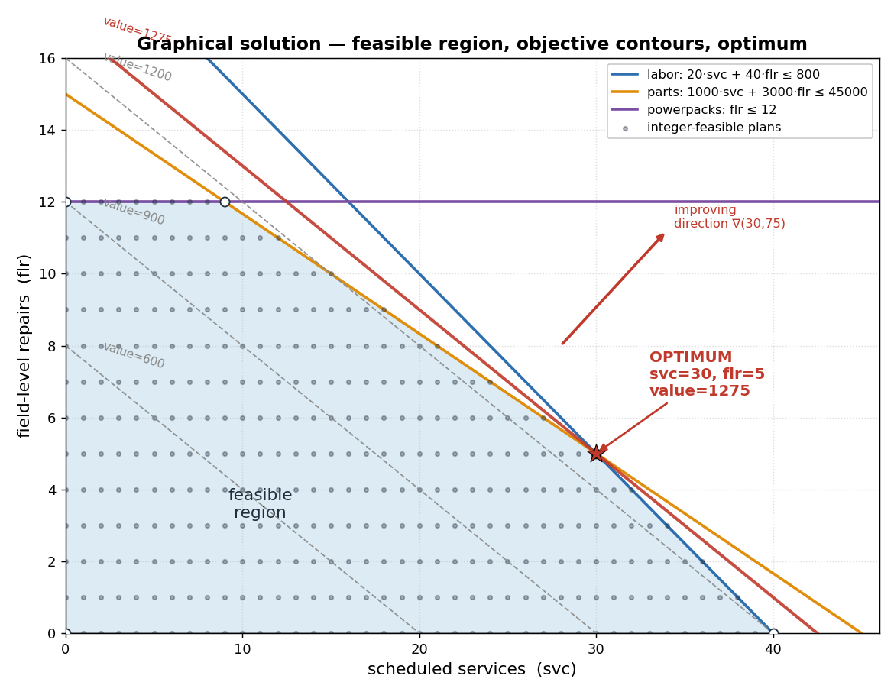

# LPO Agent

Turns a natural-language decision question into a formal linear (or mixed-integer
linear) program, solves it deterministically, and explains the result grounded
strictly in the solver's numbers.

The agent does **two** language jobs — **formulate** (English → formal model) and
**explain** (solver output → English). A classical solver (HiGHS) does everything
in between. The model never does arithmetic, which makes numeric hallucination in
the output structurally impossible (Section 7.4 of [`SPEC.md`](SPEC.md)).

```
Question + context
   │
   ▼  Formulate   (LLM, thinking mode, schema-constrained LP IR)
   ▼  Validate    (deterministic checks + human restatement gate)
   ▼  Solve       (HiGHS via PuLP → primal, duals, slacks, IIS)
   ├─ optimal ───────────────► Explain (LLM, grounded) ──► response
   └─ infeasible/unbounded ──► Diagnose ──► back to Formulate (bounded retries)
```

## Layout

| Path | Role (spec section) |
|------|---------------------|
| `lpo/models.py` | Pydantic LP IR + SolverResult; JSON Schema is generated here (§5) |
| `lpo/providers/` | Backend-neutral `LlmProvider`; `FireworksProvider`, `MockProvider` (§6.6, §8) |
| `lpo/prompts.py` | System prompt + few-shot (incl. a `need_info` example) (§6.1) |
| `lpo/formulation.py` | Calls the provider, parses the IR, detects truncation (§6.1) |
| `lpo/validation.py` | Deterministic checks + restatement renderer (§6.2) |
| `lpo/solver.py` | HiGHS/PuLP; LP-relaxation shadow prices; IIS deletion filter (§6.3, §7.3) |
| `lpo/explanation.py` | Grounded narration + critic pass + faithfulness check (§6.4) |
| `lpo/orchestrator.py` | Control flow, retry budget, confirmation gate, recovery loop (§6.5) |
| `lpo/api.py` | FastAPI REST service, two-call confirmation (§5.3) |
| `lpo/cli.py` | Command-line entry point |
| `lpo/eval.py` | IR equivalence + solution re-substitution checks (§11) |

## Frontend

A mobile-friendly React + TypeScript UI lives in [`frontend/`](frontend/). It
shows **how your prompt maps to the LP elements** (objective, variables, and
each constraint traced back to your words), then renders the solved **LP graph**
and the answer. It runs out-of-the-box in Demo mode (no backend needed) and can
switch to the live API.

```bash
cd frontend && npm install && npm run dev   # http://localhost:5173
```

## Worked example

[**docs/bradley-motor-pool-example.md**](docs/bradley-motor-pool-example.md) is a
full end-to-end run against the live Fireworks backend: a slang-heavy Army
motor-pool prompt → formal LP → graphical solution, with binding-constraint and
shadow-price visualizations.



## Install

```bash
python3 -m venv .venv && . .venv/bin/activate
pip install -r requirements.txt        # or: pip install -e .
cp .env.example .env                    # then add your FIREWORKS_API_KEY
```

## Run

**Offline (no API key)** — uses the mock provider so you can exercise the whole
pipeline:

```bash
python -m lpo.cli "We have 4 airframe-days (recon uses 1 each), 12 fuel pallets \
(resupply uses 2 each), 18 aircrew hours (recon 3, resupply 2). Recon is worth 3, \
resupply 5. How many of each to fly to maximize value?" --provider mock --yes
```

**With Fireworks** — set `FIREWORKS_API_KEY` in `.env`, drop `--provider mock`.
Omit `--yes` to review and approve the restatement at the confirmation gate.

**REST API:**

```bash
uvicorn lpo.api:app --reload
# POST /v1/solve    {"question": "...", "require_human_confirmation": true}
#   → {"status": "need_confirmation", "restatement": "...", "trace_id": "..."}
# POST /v1/confirm  {"trace_id": "...", "approved": true}
#   → {"status": "optimal", "result": {...}, "explanation": "..."}
```

## Test

```bash
pytest -q
```

The golden set (`goldens/`) includes the recon/resupply MILP and exercises IR
equivalence, solver re-substitution, explanation faithfulness, the `need_info`
short-circuit, the confirmation gate, and the infeasible→reformulate recovery
loop — all offline via the mock provider.

## Design notes

- **Correctness over speed.** A wrong-but-feasible model is the worst outcome; the
  defenses are provenance (`source` on every constraint), the human restatement
  gate, and the formulation eval set (§2, §7.2).
- **Provider-agnostic.** Only `lpo/providers/` talks to an LLM. Swapping to the
  future accredited Gemini-for-Government backend (§3.3) is a new adapter behind
  the same interface — no other component changes.
- **Integer shadow prices.** LP duality is undefined for MILPs, so shadow prices
  come from the LP relaxation, labelled `shadow_price_basis="lp_relaxation"`, and
  the explanation says so (§7.3).
- **Secrets.** Keys live in `.env` / a secret manager, never in source or logs
  (§12). `.env` is git-ignored.

See [`SPEC.md`](SPEC.md) for the full specification.
