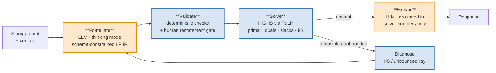
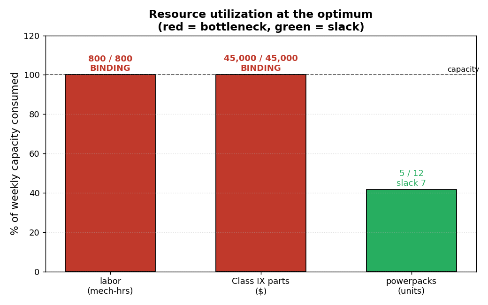
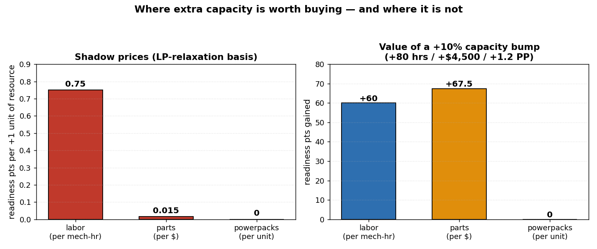

# Worked Example — Bradley Motor-Pool Week (from a slang prompt)

This document walks a **real, end-to-end run** of the LPO Agent against the live
Fireworks backend (`deepseek-v4-pro` for formulation, `gpt-oss-120b` for
explanation). It shows how a messy, jargon-filled question becomes a formal
linear program, how the solver finds the answer, and what the LP graphs tell the
commander.

> The agent does **two** language jobs — *formulate* (English → math) and
> *explain* (solver numbers → English). A deterministic solver (HiGHS) does
> everything in between, and the model never does arithmetic. See
> [`SPEC.md`](../SPEC.md).

---

## 1. The input

The prompt is deliberately written the way an NCO would actually type it —
abbreviations, approximations, no structure:

```text
planning the motor pool week for our bradleys. two work types - scheduled
svcs (pmcs) and field level repairs (the NMC ones). CO weights a FLR at 75
and a svc at 30, trying to maximize total. svc = 20 mech hrs, FLR = 40 and
wrench time is always our chokepoint. parts: svc ~1k cl ix, FLR ~3k, budget
45k. FLRs each need a rebuilt PP, we got 12 (svcs dont need one). how many
of each? whole trucks
```

*(This is the fully-specified variant. A near-identical prompt that omits the
800-hour labor capacity makes the agent return `need_info` instead of guessing —
see [§8](#8-the-robustness-story).)*

---

## 2. The pipeline



Only the orange boxes touch the model. Everything else — including the recovery
loop — is deterministic code.

---

## 3. Stage 1 — Formulate (English → LP IR)

The formulation model decoded every piece of Army shorthand and mapped it to a
typed variable, coefficient, or constraint. Crucially, **every constraint carries
a `source` span** back to the prompt (provenance), and the motivational noise
("wants deadline trucks back up bad") was correctly **not** turned into a
constraint.

| Prompt fragment | Decoded as |
|---|---|
| `svcs (pmcs)` | variable `svc` — scheduled services, integer ≥ 0 |
| `field level repairs (the NMC ones)` | variable `flr` — field-level repairs, integer ≥ 0 |
| `CO weights a FLR at 75 and a svc at 30` | objective `maximize 30·svc + 75·flr` |
| `svc = 20 mech hrs, FLR = 40 … 800 91M hrs` | labor: `20·svc + 40·flr ≤ 800` |
| `svc ~1k cl ix, FLR ~3k, budget 45k` | parts: `1000·svc + 3000·flr ≤ 45000` |
| `FLRs each need a rebuilt PP, we got 12` | powerpacks: `flr ≤ 12` |
| `whole trucks` | both variables `integer: true` |

The model emitted this **LP IR** (the output of record), guaranteed schema-valid
by constrained generation:

```json
{
  "status": "formulated",
  "sense": "maximize",
  "variables": [
    {"name": "svc", "meaning": "number of scheduled services (PMCS)", "lower": 0, "integer": true},
    {"name": "flr", "meaning": "number of field level repairs (NMC)", "lower": 0, "integer": true}
  ],
  "objective": [{"var": "svc", "coef": 30}, {"var": "flr", "coef": 75}],
  "constraints": [
    {"name": "mech_hrs",     "terms": [{"var":"svc","coef":20},{"var":"flr","coef":40}],   "op": "<=", "rhs": 800,
     "source": "svc = 20 mech hrs, FLR = 40, got 800 91M hrs this wk."},
    {"name": "parts_budget", "terms": [{"var":"svc","coef":1000},{"var":"flr","coef":3000}],"op": "<=", "rhs": 45000,
     "source": "parts: svc ~1k cl ix, FLR ~3k, budget 45k."},
    {"name": "pp_limit",     "terms": [{"var":"flr","coef":1}],                              "op": "<=", "rhs": 12,
     "source": "FLRs each need a rebuilt PP, we got 12 (svcs dont need one)."}
  ]
}
```

---

## 4. The confirmation gate (restatement)

Before anything is solved, the validation layer renders the model back to plain
English for a human to approve. A reviewer catches a flipped inequality or a
misread `~1k` in seconds:

```text
We want to maximize 30×(scheduled services) + 75×(field-level repairs), by choosing:
  - svc = number of scheduled services (PMCS) (integer, ≥ 0).
  - flr = number of field level repairs (NMC) (integer, ≥ 0).
Subject to:
  - mech_hrs:     20×svc + 40×flr   must be at most 800   [because: svc = 20 mech hrs, FLR = 40, got 800 91M hrs this wk.]
  - parts_budget: 1000×svc + 3000×flr must be at most 45000 [because: parts: svc ~1k cl ix, FLR ~3k, budget 45k.]
  - pp_limit:     1×flr             must be at most 12    [because: FLRs each need a rebuilt PP, we got 12.]
```

---

## 5. The formal model

$$
\begin{aligned}
\textbf{maximize}\quad & 30\,x_{\text{svc}} + 75\,x_{\text{flr}} \\[4pt]
\textbf{subject to}\quad
& 20\,x_{\text{svc}} + 40\,x_{\text{flr}} \le 800 && \text{(labor, mech-hrs)} \\
& 1000\,x_{\text{svc}} + 3000\,x_{\text{flr}} \le 45000 && \text{(Class IX parts, \$)} \\
& x_{\text{flr}} \le 12 && \text{(rebuilt powerpacks)} \\
& x_{\text{svc}},\, x_{\text{flr}} \ge 0,\ \text{integer}
\end{aligned}
$$

---

## 6. Stage 3 — Solve (the LP graph)

With only two decision variables we can draw the whole problem. Each constraint
is a line; the **feasible region** is the shaded polygon where every limit is
satisfied. The dashed grey lines are *iso-value* contours of the objective
(`30·svc + 75·flr = constant`); pushing them in the improving direction until
they're about to leave the feasible region lands on the optimal corner.


**Reading the graph:**

- The feasible corners are `(0,0)`, `(40,0)`, **`(30,5)`**, `(9,12)`, `(0,12)`.
- The objective improves toward the upper-right (gradient `∇(30,75)`, red arrow).
- The last contour to touch the region does so at **`(30,5)`** — the intersection
  of the **labor** and **parts** lines — giving **value 1275**.
- This optimum happens to land exactly on an integer lattice point, so the
  integer (whole-truck) answer equals the continuous one. No rounding needed.

| Corner | svc | flr | value | note |
|--------|-----|-----|-------|------|
| A | 0 | 0 | 0 | idle |
| B | 40 | 0 | 1200 | all labor on services |
| **C** | **30** | **5** | **1275** | **optimum (labor ∩ parts)** |
| D | 9 | 12 | 1170 | powerpack-capped |
| E | 0 | 12 | 900 | all powerpacks, no services |

> **The decision: complete 30 scheduled services and 5 field-level repairs for
> 1,275 readiness-priority points.**

---

## 7. What's tight, and what extra capacity is worth

### Binding vs slack

At the optimum, **labor** and **parts** are fully consumed — they are the
bottlenecks. **Powerpacks** are not: only 5 of 12 are used, leaving 7 on the
shelf.



This is why the CO's instinct ("wrench time is always our chokepoint") is only
*half* right this week — labor is tight, but the **parts budget is equally
binding**, and powerpacks are not a limiter at all.

### Shadow prices (and the integer caveat)

The solver reports a **shadow price** for each binding constraint — the marginal
readiness value of one more unit of that resource. Because this is an **integer
model**, LP duality doesn't strictly apply, so these come from the **LP
relaxation** and are labelled `shadow_price_basis = "lp_relaxation"`: directional
indicators, *not* exact per-unit guarantees.



| Resource | Shadow price | Reading | If you bought +10% |
|----------|-------------|---------|--------------------|
| Labor | **0.75** / mech-hr | each extra wrench-hour ≈ +0.75 pts | +80 hrs → **+60 pts** |
| Parts | **0.015** / $ | each extra parts-dollar ≈ +0.015 pts | +$4,500 → **+67.5 pts** |
| Powerpacks | **0** / unit | already have a surplus | +1.2 PP → **0 pts** |

**Takeaway for the commander:** buying back readiness means **more mechanic-hours
or more parts budget** — and, dollar-for-effort at these levels, loosening the
parts budget yields slightly more than labor. Acquiring more powerpacks would do
nothing this week.

---

## 8. The robustness story

The same underlying problem was run three ways. The formulation step absorbs the
linguistic variance; the deterministic solver guarantees the numbers:

| # | Prompt style | Outcome |
|---|--------------|---------|
| 1 | Formal, fully specified | svc=30, flr=5, **value 1275** ✅ |
| 2 | Slang, fully specified (this doc) | svc=30, flr=5, **value 1275** ✅ — identical |
| 3 | Slang, **800-hr labor capacity omitted** | **`need_info`**: *"What is the total available mechanic (wrench) time for the week? It is described as the chokepoint but no number is given."* |

Run 3 is the most important: the model had the labor *coefficients* (20, 40) and
was even told labor was the chokepoint — yet it **refused to invent** the missing
capacity and asked for it instead. A wrong-but-feasible model (e.g. silently
assuming 800) is the worst outcome the design defends against
([SPEC §2](../SPEC.md), §7.2).

---

## 9. Reproduce it

```bash
# Offline (mock provider) — exercises the whole pipeline, no API key:
python -m lpo.cli "<question>" --provider mock --yes

# Live (Fireworks) — set FIREWORKS_API_KEY in .env, pick real model IDs:
LPO_FORMULATION_MODEL=accounts/fireworks/models/deepseek-v4-pro \
LPO_EXPLANATION_MODEL=accounts/fireworks/models/gpt-oss-120b \
python -m lpo.cli "<question>"        # omit --yes to review the restatement gate

# Regenerate the figures in this document:
python docs/generate_figures.py
```

Every run is logged under a `trace_id` (question, IR, thinking trace, solver
result, explanation, token counts) for audit — the provenance map from each
constraint back to its `source` span is the backbone ([SPEC §10](../SPEC.md)).
